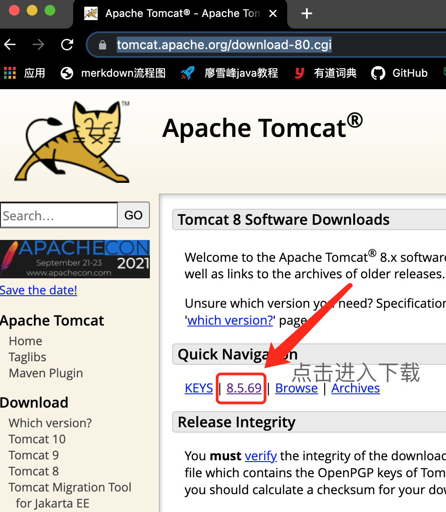
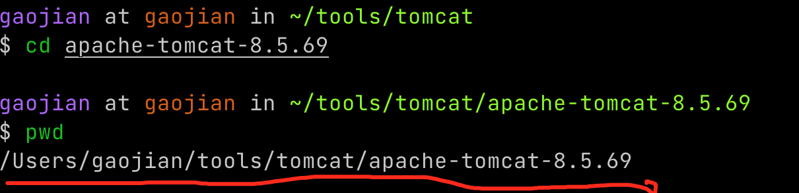
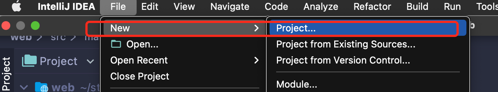
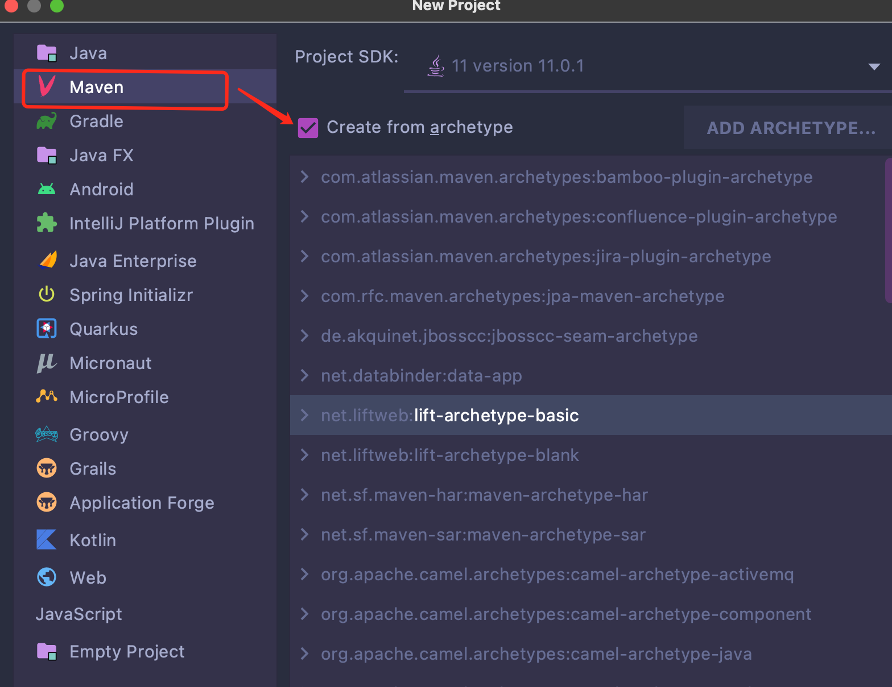
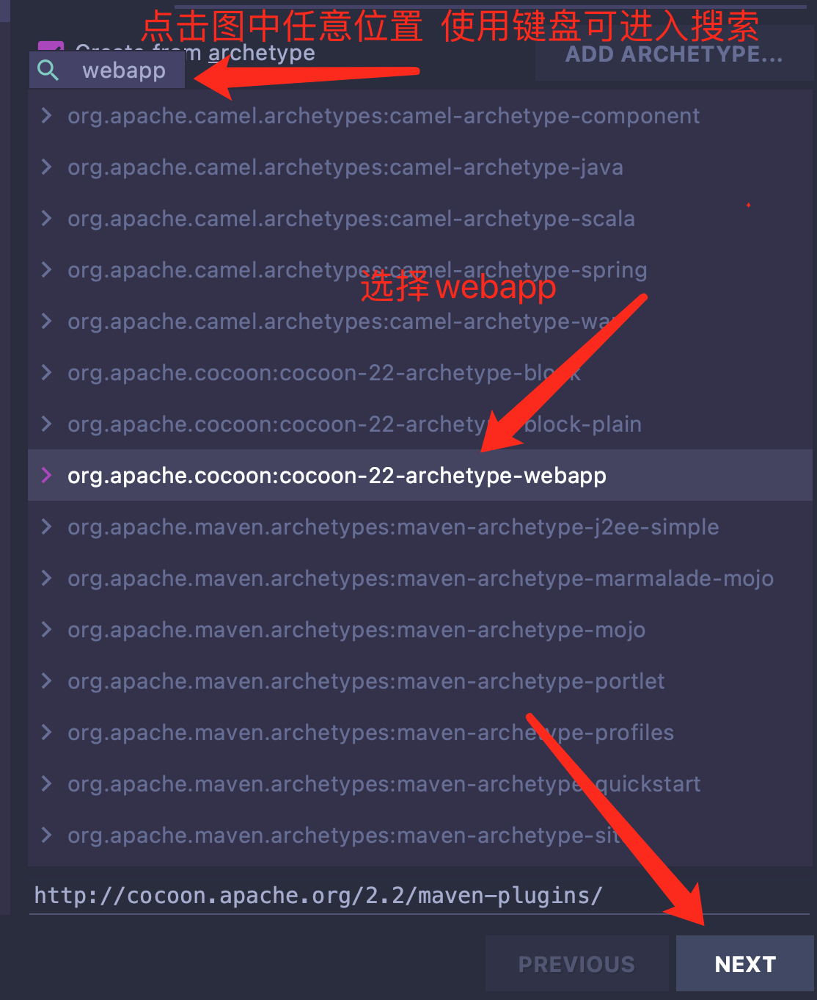
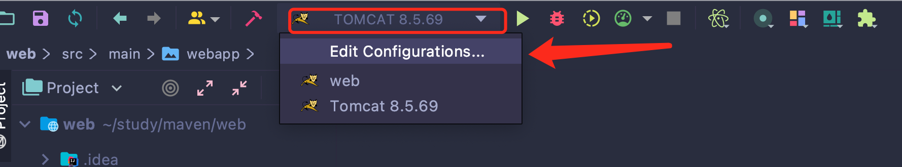
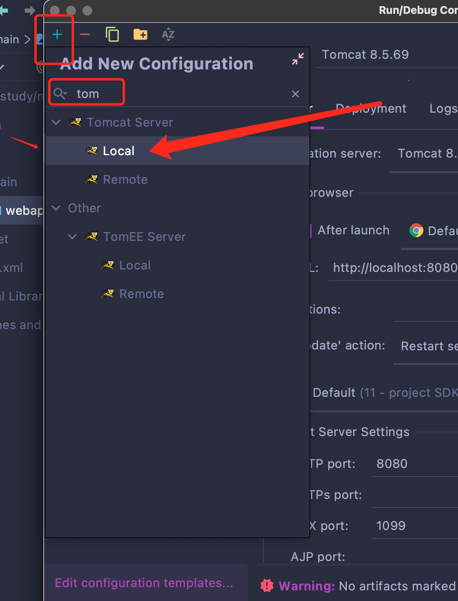
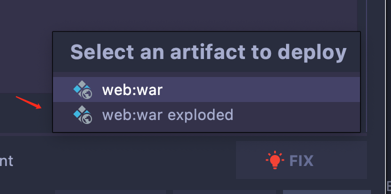

# tomcat部署

## 1.进入Tomcat官网根据电脑版本号下载tomcat

https://tomcat.apache.org/download-80.cgi

下载好后终端到一个自己指定的文件夹将其移动到其中

$ mv ~/Downloads/apache-tomcat-8.5.69.tar.gz .   

在终端中进行解压

$ tar zxvf apache-tomcat-8.5.69.tar.gz

解压完拿到文件路径后面IDE中会用到

## 2.在IDE中创建web模板

IDE中new 一个project

进入之后选中maven 勾选和选项

选完后创建标题 之后一路下一步

## 3运行Tomcat

1首先进行打包不打包无法运行 mvn clean install 

2进行配置，点击Edit

点击+号 输入tom搜索 选择本地的Local

选择完local 点击FIX 出现两个选项选择第二个

之后点击OK，即可运行
